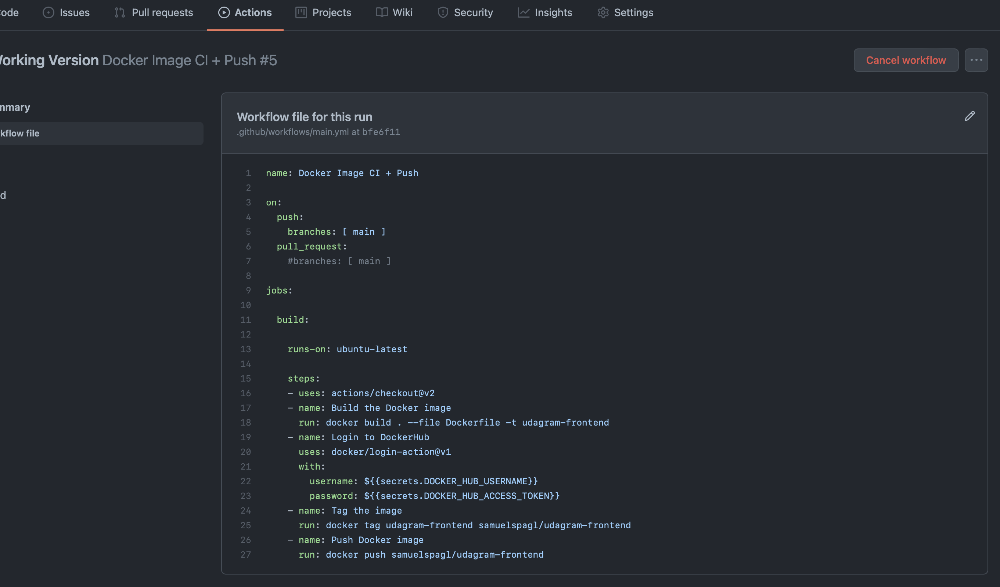

# udagram-refactor

Udagram is a simple cloud application, which is developed while enrollment in the *Udacity Nanodegree - Cloud Developer*. 
The main achievement in this project was to refactor a monolith to a microservice based cloud application. 

This is achieved by splitting the monolith into 4 parts:
- Frontend
- Rest-Api-Feed
- Rest-Api-User
- A reverseproxy

Everything is deployed via EKS in AWS.

The subprojects are included in this repositor as submodules. For getting everything to work as excpected locally a `.env` file is required in each of the repository. In this file it is possible to store your environment variables. 
You can include such a file in Docker Compse with the parameter `--env-file .env`. 

## Udagram-api-frontend 

This project is build using Typescript and the Ionic framework. For more instructions how to start, please look into the repository.

## Udagram-api-feed 

## Udagram-api-user 

## Udagram-reverseproxy 

## Screenshots: 

### Creating GitHub Repositories for each of the parts, and dockerize them:

### Setting up a GitHub Actions CI Pipeline
This part differs a bit of the script, as I am not using TravisCI but Github Actions. This has two main reasons:
- First in a "real world" implementation each of the microservices would be independent repositories
- Second these repositories would be wanted to be build at seperate times, because multiple teams are working on these. 
Additionally TravisCI is requiring a CreditCard as they have a "Freemium" Model. Github Actions are completly free for public repositories.

### Setting up a kubernetes cluster on AWS

### Finished work:

More screenshots can be found in the screenshots folder.
